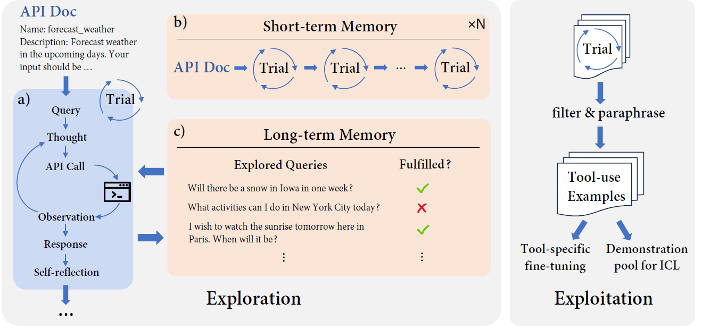
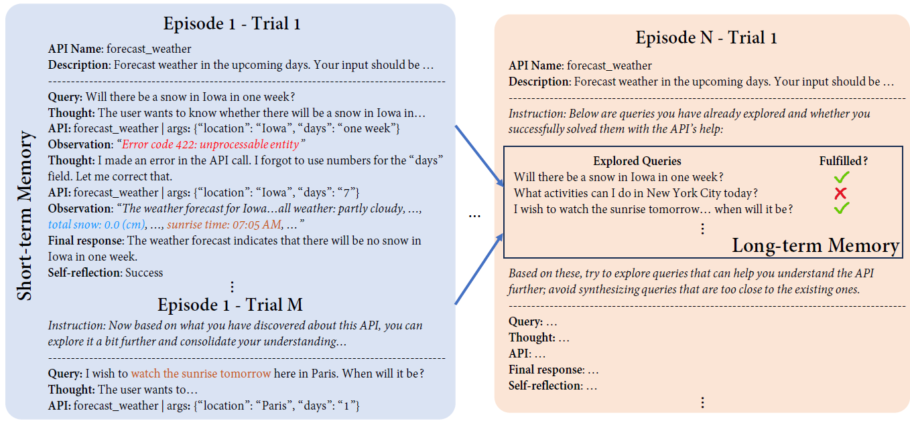

## LLMs in the Imaginarium: Tool Learning through Simulated Trial and Error

>Tools are essential for large language models (LLMs) to acquire up-to-date information and take consequential actions in external environments. Existing work on tool-augmented LLMs primarily focuses on the broad coverage of tools and the flexibility of adding new tools. However, a critical aspect that has surprisingly been understudied is simply _how accurately an LLM uses tools for which it has been trained_. We find that existing LLMs, including GPT-4 and open-source LLMs specifically fine-tuned for tool use, only reach a correctness rate in the range of 30% to 60%, far from reliable use in practice. We propose a biologically inspired method for tool-augmented LLMs, simulated trial and error (STE), that orchestrates three key mechanisms for successful tool use behaviors in the biological system: trial and error, imagination, and memory. Specifically, STE leverages an LLM's `imagination' to simulate plausible scenarios for using a tool, after which the LLM interacts with the tool to learn from its execution feedback. Both short-term and long-term memory are employed to improve the depth and breadth of the exploration, respectively. Comprehensive experiments on ToolBench show that STE substantially improves tool learning for LLMs under both in-context learning and fine-tuning settings, bringing a boost of 46.7% to Mistral-Instruct-7B and enabling it to outperform GPT-4. We also show effective continual learning of tools via a simple experience replay strategy.




### File Structure
```
STE/
├─  tool_metadata/: tool related metadata
├─  prompts/: full prompts used
├─  saved_results/: prediction results in json
    ├─ {*, *_FT, *_ICL}.json: results for baseline model, tool-enhanced w/ fine-tuning, tool-enhanced with ICL
    ├─ CL_round_*.json: continual learning (each round)
├─  main.py: main script for STE
├─  postprocessing.py: filtering & paraphrasing for tool enhancement
├─  evaluation.ipynb: evaluation script and cached evaluation results
├─  my_llm.py: helper functions for LLM API call
└── utils.py: other helper functions

llama-recipes/ (adapted from https://github.com/facebookresearch/llama-recipes/)
├─  configs/: configurations for model training
    ├─ training.py: model training-related arguments
    ├─ ...
├─  ft_datasets/: cached data files for fine-tuning and testing
    ├─ api2neighbors.json: nearest neighbors for each API (based on API description similarity)
    ├─ flan_v2_2k.json: 2k random examples from flan_v2
    ├─ tool_data_train_STE_*.json: distilled tool-specific training data
    ├─ tool_test*.json: test set (w/ retrieved demonstration examples)
    ├─ ...
├─  inference/: helper functions for model inference
├─  sysmsg_dir/: system messages for tool and non-tool mode
├─  jobs/: example bash scripts for training/inference
├─  llama_finetuning.py: scripts for model training
├─  data_proc_format.py: data formatting/merging for model training
└── demo_retrieve.ipynb: nearest-neighbor demonstration retrieval
```
### Environment Setup

Put your OpenAI API key in ```api_key.txt``` in the parent directory.

- For ```STE/```, install [ToolBench](https://github.com/OpenBMB/ToolBench), [BMTools](https://github.com/OpenBMB/BMTools) and acquire the associated API keys following their respective instructions, and then
```
pip install -r requirements.txt
```
- For ```llama-recipes/```, set up the environment following https://github.com/facebookresearch/llama-recipes.

### Exploration w/ STE
```
cd STE
python main.py \
    --model_ckpt gpt-3.5-turbo-16k-0613 \
    --num_episodes 15 \
    --num_stm_slots 4 \
    --max_turn 4 \
    --dir_write <your_directory_to_write> \
    --rapidapi_key <your_rapidapi_key> \
    --if_visualize
```

#### Custom tool
For STE with custom APIs, simply append the API names and descriptions to ```API_list.json``` and ```API_descriptions.json``` in ```tool_metadata/```, and change the ```run_tool``` function in ```main.py``` to enable the execution of newly-added tools.

### Exploitation w/ STE
#### Data preparation
```
python postprocessing.py \
    --directory <your_directory_to_write> \
    --filter_model_ckpts gpt-4-8k \
    --paraphrase_model_ckpts gpt-3.5-turbo-16k-0613 \
    --target_num_train_per_API 150 \
    --num_para_train_max 6 \
    --save_file_name <your_save_file_name> \
    --if_visualize
```
#### Fine-tuning & Inference
```
cd llama-recipes/
python data_proc_format.py \
    --tool_file <your_save_file_name> \
    --data_save_dir <your_data_directory> \
    --no_general \
    --add_tool_response

CUDA_VISIBLE_DEVICES=0,1,2,3 torchrun --nnodes 1 --nproc_per_node 4 llama_finetuning.py \
    --enable_fsdp \
    --model_name <your_model_directory> \
    --num_epochs 2 \
    --batch_size_training 16 \
    --micro_batch_size 1 \
    --val_batch_size 8 \
    --lr 2e-5 \
    --num_workers_dataloader 1 \
    --seed 42 \
    --data_path <your_data_directory> \
    --max_words_dataset 2048 \
    --checkpoint_folder <your_directory_to_save> \
    --save_with_hf \
    --warmup_ratio 0.03 \
    --save_epoch_interval 1 \
    --add_token_list ft_datasets/toolken_list_50.json
    
CUDA_VISIBLE_DEVICES=0 python inference/inference_chat.py \
    --model_name <your_model_directory> \
    --data_path ft_datasets/tool_test.json \
    --save_path <your_save_directory> \
    --item_type query \
    --sys_msg_dir sys_msg_dir/sysmsg_tool.json \
    --quantization
```
#### ICL
First run ```demo_retrieve.ipynb``` to prepare retrieved demonstration examples.
- For GPT-3.5/4:
```
cd STE/
python test_gpt.py \
    --model_ckpt {gpt-35-turbo-16k-0613|gpt-4-0613}\
    --save_name <save_file_name> \
    --setting ICL \
    --if_visualize
```
- For models based on Llama/Mistral:
```
cd llama-recipes/
CUDA_VISIBLE_DEVICES=0 python inference/inference_chat.py \
    --model_name <your_model_directory> \
    --data_path ft_datasets/tool_test_OTR_DR.json \
    --save_path <your_save_directory> \
    --item_type dialog \
    --sys_msg_dir sys_msg_dir/sysmsg_tool.json \
    --quantization
```

### Continual Learning with Rehearsal
For round {0|1|2|3},
```
cd llama-recipes/
python data_proc_format.py \
    --tool_file ft_datasets/tool_data_batches.json \
    --batch_id {0|1|2|3} \
    --data_save_dir ft_datasets/CL_round_{0|1|2|3}.json \
    --general_data_file ft_datasets/flan_v2_2k.json \
    --add_tool_response \
    {--no_replay}

CUDA_VISIBLE_DEVICES=0,1,2,3 torchrun --nnodes 1 --nproc_per_node 4  llama_finetuning.py \
    --enable_fsdp \
    --model_name <your_model_directory> \
    --num_epochs 2 \
    --batch_size_training 16 \
    --micro_batch_size 1 \
    --val_batch_size 8 \
    --lr 2e-5 \
    --num_workers_dataloader 1 \
    --seed 42 \
    --data_path ft_datasets/CL_round_{0|1|2|3}.json \
    --max_words_dataset 2048 \
    --checkpoint_folder ft_datasets/CL_round_{0|1|2|3}.json \
    --save_with_hf \
    --warmup_ratio 0.03 \
    --save_epoch_interval 1 \
    --add_token_list ft_datasets/toolken_list_50.json
```

### Evaluation
```STE/evaluation.ipynb``` includes the evaluation scripts and cached evaluation results for all predictions files in ```STE/saved_results/```

### Citation
```
@misc{wang2024llms,
      title={LLMs in the Imaginarium: Tool Learning through Simulated Trial and Error}, 
      author={Boshi Wang and Hao Fang and Jason Eisner and Benjamin Van Durme and Yu Su},
      year={2024},
      eprint={2403.04746},
      archivePrefix={arXiv},
      primaryClass={cs.CL},
      url={https://arxiv.org/pdf/2403.04746.pdf}
}
```
